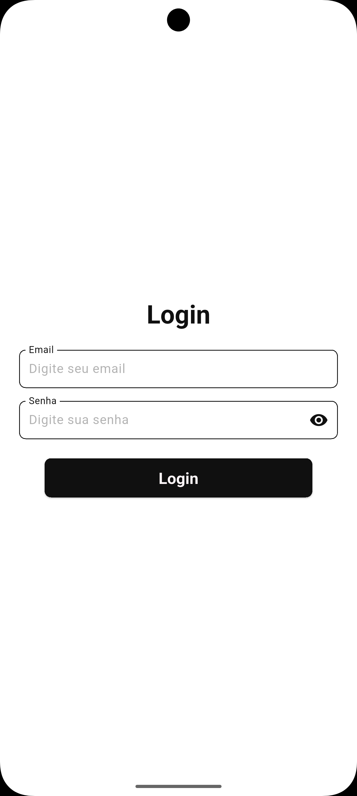
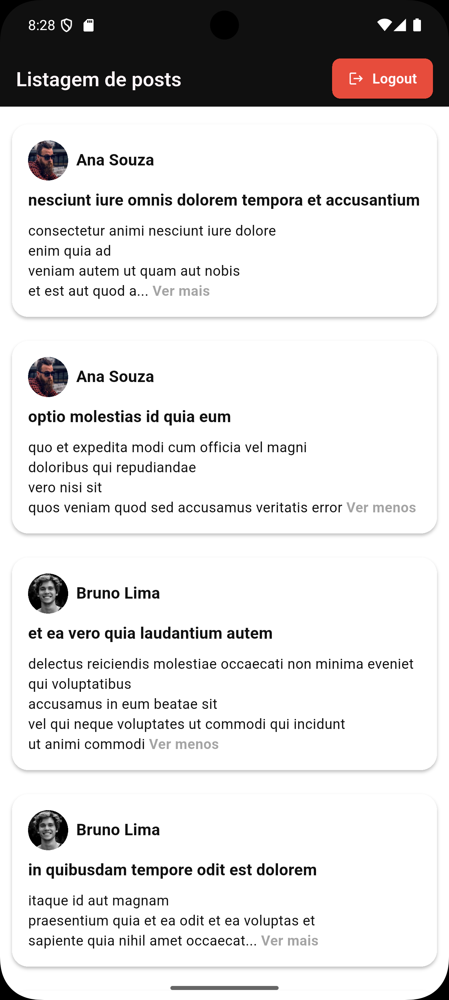
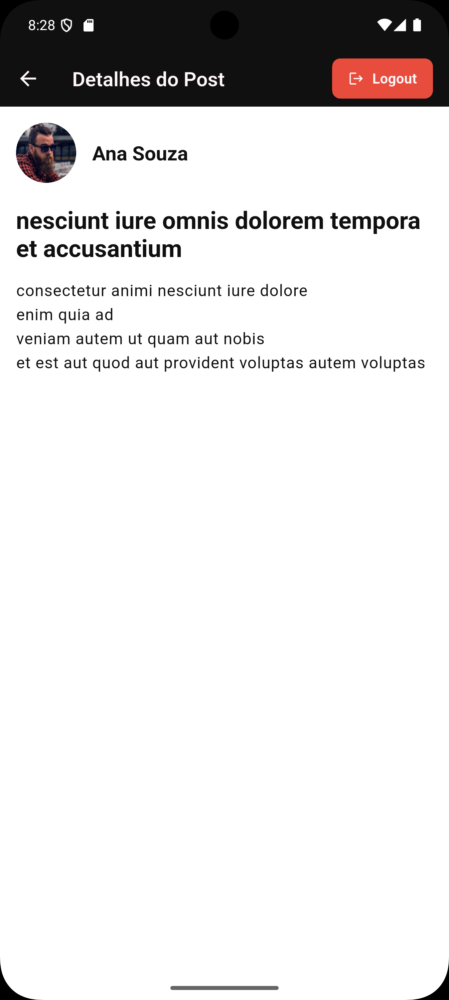
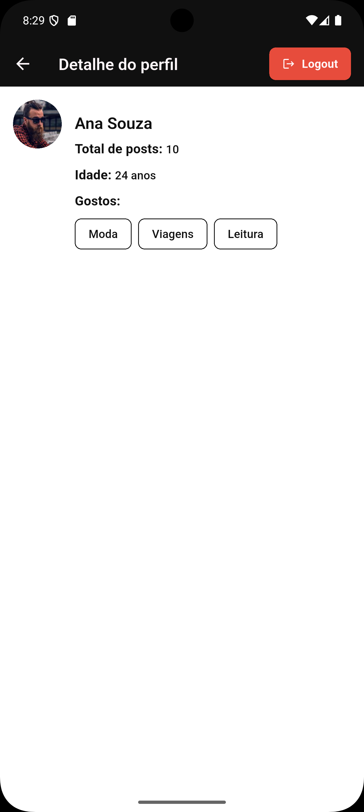

# Teste Lisa IT

Um aplicativo Flutter de demonstração implementando autenticação, gerenciamento de estado e testes automatizados.

## Objetivo:

Desenvolver um aplicativo móvel utilizando Flutter para autenticação via OAuth, consumo de
uma API pública

## 📋 Descrição do Projeto

Este aplicativo foi desenvolvido como um teste técnico para uma oportunidade na Lisa IT. Trata-se de uma demonstração de capacidades técnicas e boas práticas no desenvolvimento de aplicativos móveis com Flutter.

O aplicativo permite que usuários se autentiquem utilizando Firebase Authentication e visualizem dados provenientes de uma API externa (JSONPlaceholder), com tratamento adequado de erros, validações de entrada e testes automatizados.

## 🎯 Funcionalidades Principais

- Login
- Logout
- Feed de posts
- Tela de detalhe do post
- Tela de detalhe do perfil do dono do post

## 📱 Telas

### 🔒 Login | 📰 Feed de Posts | 📝 Detalhe do Post | 👤 Perfil do Usuário

<div style="display: flex; gap: 16px; flex-wrap: wrap; align-items: flex-start;">

  
  
  
  

</div>

## 🔒 Credenciais para teste

Use as seguintes credenciais para testar o aplicativo:

- **Email**: user.teste@gmail.com
- **Senha**: Teste@123

## 🚀 Instruções de execução

### Pré-requisitos

- Flutter SDK (versão mais recente)
- Android Studio/VS Code com plugins Flutter/Dart
- Firebase CLI (para emuladores locais - opcional)

### Passos para instalação e execução

1. **Clone o repositório e acesse a pasta do projeto**

   ```bash
   git clone https://github.com/ozerikoz/teste-lisa-it.git
   cd teste-lisa-it
   ```

2. **Instale as dependências**

   ```bash
   flutter pub get
   ```

3. **Execute o aplicativo**
   ```bash
   flutter run
   ```

## 🧪 Executando os testes

### Testes unitários

```bash
flutter test
```

### Testes de integração

```bash
flutter test integration_test/app_flow_test.dart
```

## 🏗️ Arquitetura do projeto

Este projeto utiliza a **Clean Architecture** dividida em camadas para manter o código organizado, testável e de fácil manutenção:

### Camadas principais:

1. **Presentation (UI)**

   - Widgets, telas e componentes visuais
   - Blocs/Cubits para gerenciamento de estado
   - Eventos e estados associados a cada feature

2. **Domain**

   - Entidades do negócio
   - Repositories (interfaces)
   - Validadores

3. **Data**

   - Implementação dos repositories
   - Serviços externos (API, Firebase, etc.)
   - Modelos de dados e mapeadores

4. **Core**
   - Componentes compartilhados
   - Injeção de dependências
   - Constantes e configurações
   - Tratamento de exceções global

## 📋 Justificativas para escolhas técnicas

### Clean Architecture

- **Separação de responsabilidades**: Cada camada tem um propósito bem definido
- **Testabilidade**: Facilita a escrita de testes unitários e de integração
- **Manutenção**: Facilita a manutenção e evolução do código
- **Escalabilidade**: Facilita a adição de novos recursos sem afetar o existente

### Bloc/Cubit para gerenciamento de estado

- **experiência prévia**: Gerenciamento de estado utilizado anteriormente em outros projetos.
- **Previsibilidade**: Fluxo unidirecional de dados
- **Testabilidade**: Estados são facilmente testáveis
- **Reatividade**: Atualização automática da UI quando o estado muda
- **Separação de lógica e UI**: Código mais limpo e organizado

### Firebase Authentication

- **Segurança**: Mecanismos de autenticação seguros e testados
- **Facilidade de uso**: API simples de usar e integrar
- **Escalabilidade**: Suporta diversos métodos de autenticação

### Tratamento de Exceções personalizado

- **Mensagens amigáveis**: Erros traduzidos para o usuário
- **Manutenção**: Facilita o diagnóstico de problemas
- **Consistência**: Tratamento uniforme de erros em todo o app

## 🔄 Como expandir ou escalar a solução no futuro

Seguir o padrão de estrutura e arquitetura inicial. Implementar funcionalidade, melhorias e ajustes sem alterar o que foi planejado inicialmente, Facilitando o entendimento de outros desenvolvedores e facilidade na escalabilidade do projeto.

### Adicionando novas features

1. **Nova entidade de domínio**:

   - Crie a classe na pasta `domain/entities/`
   - Implemente a interface do repositório em `domain/repositories/`
   - Adicione a implementação concreta em `data/repositories/`

2. **Novos serviços externos**:

   - Adicione novos serviços em `data/services/`
   - Implemente tratamento de erro específico em `data/exceptions/`

3. **Nova tela ou fluxo**:
   - Adicione a UI em `presentation/feature_name/`
   - Crie o Bloc/Cubit correspondente para gerenciar o estado

### Melhorias

- [ ] Aumentar cobertura de testes
- [ ] Incrementar temas
- [ ] Componentizar mais widgets e códigos reútilizados
- [ ] Aumentar cobertura de documentação do projeto

### Considerações de escalabilidade

- **Modularização**: Dividir o app em módulos quando crescer
- **Cache**: Implementar estratégias de cache para reduzir chamadas ao servidor

---

## 📦 Dependências principais

- **flutter_bloc**: Gerenciamento de estado
- **equatable**: Comparação eficiente de objetos
- **provider**: Injeção de dependências
- **firebase_auth**: Autenticação
- **firebase_core**: Core do Firebase
- **dio**: pacote HTTP
- **go_router**: Pacote de gerenciamento de rotas
